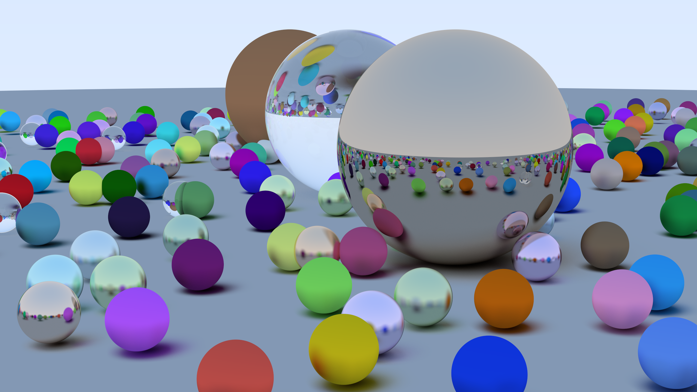

# CUDA Ray Tracing 3.6x Faster Than RTX

A high-performance CUDA implementation of "Ray Tracing in One Weekend" that demonstrates the power of GPU optimization through a series of progressive improvements.
📘 Read the full article: [CUDA Ray Tracing 3.6x Faster Than RTX](https://karimsayedre.github.io/RTIOW.html)


*2560x1440 resolution, 50 max depth, 3000 samples, 3400ms on an RTX 3080.*

## Performance Journey

This project started as a naive CUDA port running at **2.5 seconds per frame** and was optimized down to **9 milliseconds per frame** - a **277x speedup**! Each optimization tackled specific GPU bottlenecks:

## 🚀 Major Optimizations Implemented
* Eliminated Recursion       
* Precomputed Bounding Boxes 
* Early Ray Termination      
* Structure of Arrays (SoA)  
* Memory Alignment           
* Russian Roulette Sampling  
* Constant Memory Usage      
* NVIDIA's RNG (PCG+LCG)     
* Branchless Materials       
* CUDA↔OpenGL Interop        

### 🎯 Key Technical Achievements

- **Cache Hit Rate**: Almost perfect cache hit rate, everything fit's in L1 cache
- **Memory Requests**: Reduced global memory requests 
- **Warp Efficiency**: Eliminated divergent branching in material sampling
- **Register Pressure**: Minimized through explicit stack management, constant memory, and elimination of recursion

## Features

- **CPU/GPU rendering modes**: Press F2 to toggle rendering modes 
- **BVH Acceleration Structure** with Surface Area Heuristic (SAH) construction
- **Advanced Sampling**: Russian Roulette path termination and importance sampling
- **Memory Optimized**: Structure of Arrays (SoA) layout for cache efficiency
- **Real-time Performance**: Optimized for interactive frame rates
- **Direct GPU Rendering**: CUDA↔OpenGL interop for zero-copy display
- **Frames in flight**: Less waiting for CPU each frame

## Controls
- Press F2 to toggle between CPU and GPU rendering.
- Press M to toggle camera movement.
- Window is resizeable.

## Build Instructions

### Prerequisites

- **Visual Studio 2022** (with MSVC compiler)
- **CUDA Toolkit** 12.6 or later is tested
- **CMake** 3.18 or later

### Building

1. **Clone the repository**
   ```bash
   git clone https://github.com/karimsayedre/CUDA-Ray-Tracing-In-One-Weekend.git
   cd CUDA-Ray-Tracing-In-One-Weekend
   ```

2. **Generate build files**
   ```bash
   mkdir build
   cd build
   cmake ..
   ```

3. **Run the Visual Studio solution**
   ```bash
   ./RayTracingInOneWeekend.sln
   ```

### **Note**
   sm120 compilation is currently disabled because it's buggy in CUDA 12.9.

### CMake Configuration

The project uses a simple CMake setup that automatically detects CUDA and configures the necessary compiler flags for optimal performance.

## Technical Deep Dive

### Memory Layout Transformation

The most impactful optimization was restructuring from Object-Oriented Arrays (AoS) to Structure of Arrays (SoA):

**Before (AoS):**
```cpp
class Sphere : public Hittable {
    Vec3 center;
    float radius;
};
```

**After (SoA):**
```cpp
struct Spheres {
    Vec3*     center;         // packed sequentially
    float*    radius;         // packed sequentially  
    uint32_t  count;
};
```

### BVH Traversal Optimization

Replaced recursive tree traversal with an explicit stack to eliminate register pressure:

```cpp
__device__ bool Hit(const Ray& r, float tMin, float tMax, HitRecord& rec) const
{
    Hittable* stack[16];
    int stack_ptr = 0;
    // Iterative traversal logic...
}
```

### Custom Random Number Generation

Used a lightweight PCG+LCG from NVIDIA replacing CUDA's curand for significant performance gains in sampling-heavy workloads.

## Performance Profiling

Key metrics tracked throughout development:
- **Frame time** (primary metric)
- **Memory bandwidth utilization**
- **Cache hit rates** (L1/L2)
- **Register usage per thread**
- **Warp occupancy**
- **Global memory requests**

## Benchmark Results And Tested Hardware
| GPU / CPU       | 1280x720 | 1920x1080 | 2560x1440 | 3840x2160 |
| --------------- | -------- | --------- | --------- | --------- |
| RTX 3080        | 9.12 ms  | 19.5 ms   | 35 ms     | 76 ms     |
| i5-13600KF      | 450 ms   | 980 ms    | 1770 ms   | 3845 ms   |
| RTX 3050 Laptop | 27 ms    | 53 ms     | 115 ms    | 256 ms    |
| i5-13450HX      | 1000 ms  | 2250 ms   | 4565 ms   | 10350 ms  |
| RTX 4050 Laptop | 20 ms    | 40 ms     | 75 ms     | 165 ms    |
| i7-13700H       | 725 ms   | 1450 ms   | 2675 ms   | 8284 ms   |

## References

- [Ray Tracing in One Weekend](https://raytracing.github.io/books/RayTracingInOneWeekend.html) - Original CPU implementation
- [GPSnoopy's RayTracingInVulkan](https://github.com/GPSnoopy/RayTracingInVulkan) - RTX Vulkan Ray Tracing 
- [NVIDIA CUDA Programming Guide](https://docs.nvidia.com/cuda/cuda-c-programming-guide/index.html) - GPU optimization techniques
- [Accelerated Ray Tracing in One Weekend in CUDA](https://developer.nvidia.com/blog/accelerated-ray-tracing-cuda/) - Cuda ray tracing in one weekend blog
- [Nvidia Optix Advanced Samples](https://github.com/nvpro-samples/optix_advanced_samples/blob/master/src/device_include/random.h) - Fast RNG code

## License

This project is licensed under the MIT License - see the [LICENSE](LICENSE.md) file for details.

## Acknowledgments

- Peter Shirley for the original "Ray Tracing in One Weekend" book
- NVIDIA for the CUDA toolkit and excellent profiling tools
- The graphics programming community for optimization insights

